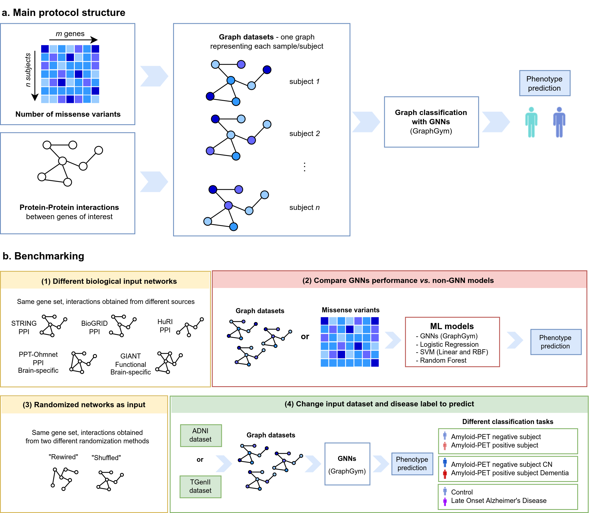

# graph_genetics

## Description

This is the code repository for the paper entitled *On the limits of graph neural networks for the early diagnosis of Alzheimer’s
Disease*. The repository follows the methodology and results presented in the abovementioned work. 

The results obtained for the manuscript are organized in the following notebooks:

* [1_ADNI_GNNs_networks](1_ADNI_GNNs_networks.ipynb) - for Section *3.1. Comparing results using different input networks*
* [2_ADNI_GNNs_vs_nonGNNs](2_ADNI_GNNs_vs_nonGNNs.ipynb)  - for Section *3.2. Benchmarking GNNs performance vs. canonical machine learning models*
* [3_ADNI_GNNs_random_networks](3_ADNI_GNNs_random_networks.ipynb)  - for Section *3.3. Using randomized networks as input*
* [4_LOAD_GNNs](4_LOAD_GNNs.ipynb)  - for Section *3.4. Using another dataset as input*

These notebooks use information from several scripts, organized in the following subdirectories:

* [data_preprocessing](data_preprocessing) - scripts for obtaining AD-related genes and genetic data from the different cohorts employed.
* [networks](networks)- scripts for obtaining biological networks from different sources and build random networks.
* [create_datasets](create_datasets) - scripts for building different datasets for supervised classification models.
  * [create_nx_datasets.py](create_datasets/create_nx_datasets.py) - for building graph-datasets for Graph Neural Networks (GNNs)
* [ml_models](ml_models) - scripts with different functions for using with other non-GNN models.

Other subdirectories present in this repository:

* [data](data) contains several data files used in this work.
* [results](results) CSV files with the results presented in this work.
* [figures](figures)

Please note that several files such as raw genetic data, graph and table datasets build from it, and metadata files for cohorts' description are not available in this repository due to privacy reasons.

## Implementation

The code in this work was built using:

* [disgenet2r](https://www.disgenet.org/disgenet2r) for obtaining GDAs from DisGeNET.
* [biomaRt](https://bioconductor.org/packages/release/bioc/html/biomaRt.html) for obtaining genomic coordinates of the genes of interest.
* [VCFTools](http://vcftools.sourceforge.net/) and [Ensemble's Variant Effect Predictor (VEP)](https://www.ensembl.org/info/docs/tools/vep/index.html) for extracting and annotating missense variants.
* [NetworkX](https://networkx.org/) for networks' manipulation and building graph datasets.
* [GraphGym](https://github.com/snap-stanford/GraphGym) for evaluating and testing GNN models on graph datasets.
* [Scikit-Learn](https://scikit-learn.org/stable/) for building non-GNN models.
* [SciPy](https://scipy.org/) for statistical analyses.

We provide an [Anaconda environment](graphgenetics.yml) including all the dependencies.

More information about the project can be found at this [AIMe report](https://aime.report/thfKRo).

## Contact
Please refer any questions to:
Laura Hernández-Lorenzo - [GitHub](https://github.com/laurahdezlorenzo) - [email](laurahl@ucm.es)
